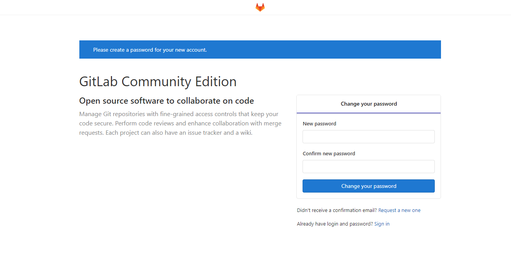
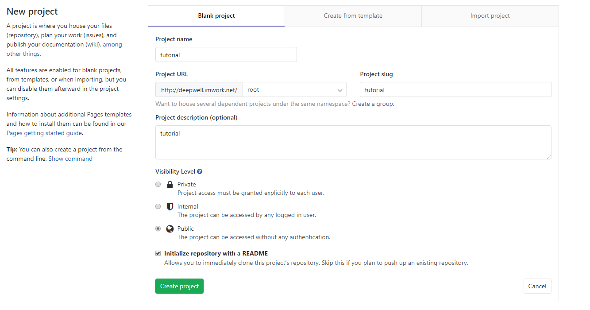
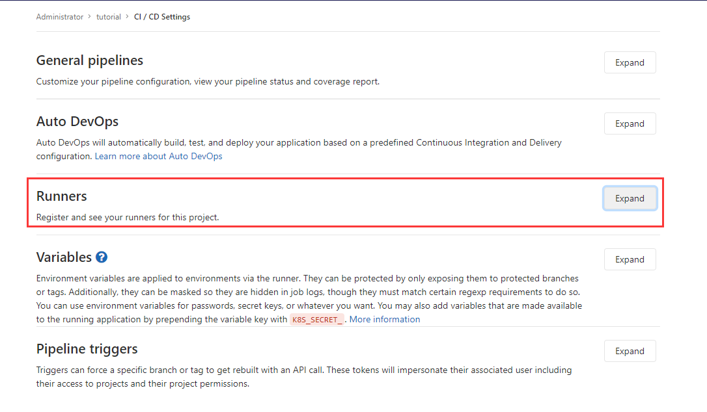
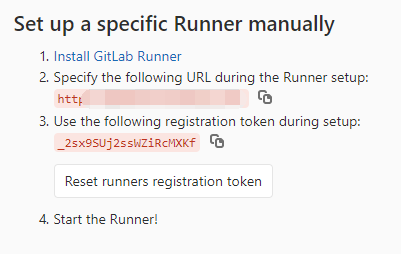
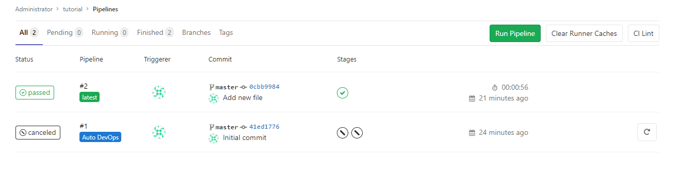

# gitlab_server
本地实现gitlab.com的功能

创建docker-compose.yml配置文件：
```yaml
version: "3.7"

services:
  web:
    image: 'gitlab/gitlab-ce:latest'
    restart: always
    hostname: web
    environment:
      GITLAB_OMNIBUS_CONFIG: |
        external_url 'https://gitlab.example.com'
        gitlab_rails['gitlab_shell_ssh_port'] = 2224
        # Add any other gitlab.rb configuration here, each on its own line
        unicorn['socket'] = '/opt/gitlab/var/unicorn/gitlab.socket'
    ports:
      - '8929:80'
      - '443:443'
      - '2224:22'
    volumes:
      - '/srv/gitlab/config:/etc/gitlab'
      - '/srv/gitlab/logs:/var/log/gitlab'
      - '/srv/gitlab/data:/var/opt/gitlab'
    networks:
      - gitlab-network


  gitlab-runner:
    image: 'gitlab/gitlab-runner:latest'
    container_name: 'gitlab-runner'
    hostname: gitlab-runner
    restart: always
    volumes:
      - '/var/run/docker.sock:/var/run/docker.sock'
      - './gitlab-runner/config:/etc/gitlab-runner'
    networks:
      - gitlab-network


networks:
  gitlab-network:
    name: gitlab-network
```
注意上面的`https://gitlab.example.com`改成自己的域名，记得不要用本地的`127.0.0.1`之类的，会导致后gitlab-runner面获取不到代码

运行gitlab:
```shell
docker-compose up web
docker exec -it gitlab-runner gitlab-runner register --non-interactive --registration-token _2sx9SUj2ssWZiRcMXKf --locked=false --description docker-stable --url http://deepwell.imwork.net/ --executor docker --docker-image docker:stable --docker-volumes "/var/run/docker.sock:/var/run/docker.sock" --docker-network-mode gitlab-network

```

这样便是搭建好了，使用 `https://gitlab.example.com`就可以访问我们的gitlab了，第一次登陆的时候会要求我们设置root用户的密码。
web启动的比较慢...这个需要一些耐心



设置了密码之后，我们登陆gitlab，创建一个项目，如下：


我们进入settings->CI/CD Runners的设置：

点进去，获取我们注册gitlab-runner所需要的信息：


然后运行下面的语句，注册gitlab-runner:
记得把registration-token 和 url 参数替换成自己的。
```shell
docker-compose up gitlab-runner
docker exec -it gitlab-runner gitlab-runner register --non-interactive --registration-token _2sx9SUj2ssWZiRcMXKf --locked=false --description docker-stable --url http://deepwell.imwork.net/ --executor docker --docker-image docker:stable --docker-volumes "/var/run/docker.sock:/var/run/docker.sock" --docker-network-mode gitlab-network
```
然后在项目中添加我们测试用的ci配置文件`.gitlab-ci.yml`:
```yaml
image: docker:latest

services:
  - docker:dind

before_script:
  - docker info

build:
  stage: build
  script:
    - docker ps -a

```

进入到CI/CD->Piplines,等待分配gitlab-runner自动运行CI任务，稍后我们会发现运行Passed了，就表示你已经成功搭建了gitlab ci/cd 服务器。



如果你要开通邮件服务，可以在`GITLAB_OMNIBUS_CONFIG`下设置邮件服务信息：
```yaml
        # email setting
        gitlab_rails['smtp_enable'] = true
        gitlab_rails['smtp_address'] = "smtp.gmail.com"
        gitlab_rails['smtp_port'] = 587
        gitlab_rails['smtp_user_name'] = "my.email@gmail.com"
        gitlab_rails['smtp_password'] = "my-gmail-password"
        gitlab_rails['smtp_domain'] = "smtp.gmail.com"
        gitlab_rails['smtp_authentication'] = "login"
        gitlab_rails['smtp_enable_starttls_auto'] = true
        gitlab_rails['smtp_tls'] = false
        gitlab_rails['smtp_openssl_verify_mode'] = 'peer'
```